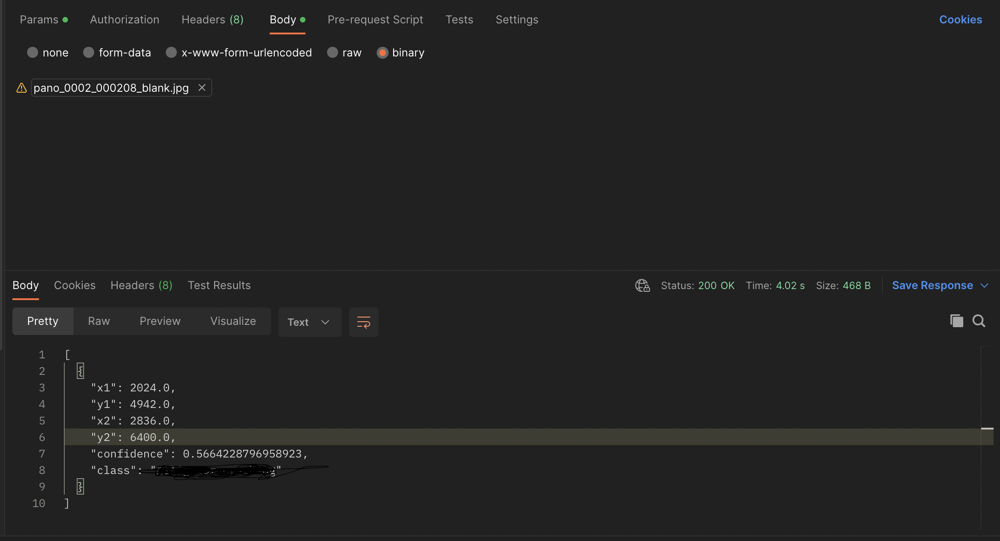

# Yolov5 running on TorchServe (GPU compatible) !

This is a dockerfile to run TorchServe for Yolo v5 object detection model. 
(TorchServe (PyTorch library) is a flexible and easy to use tool for serving deep learning models exported from PyTorch).

You just need to pass a yolov5 weights file (.pt) in the ressources folder and it will deploy a http server, ready to serve predictions.

## Setting up the docker image

1) Build the torchserve image locally if using a GPU (error with the dockerhub one):
`Build the image torchserve locally for GPU before running this (cf github torchserve)`
 `https://github.com/pytorch/serve/tree/master/docker`
 
 Note: for CPU only, you can take the image from docker-hub directly, it should work fine.
 
2) After trainning a yolo v5 model on COLAB, move the `model.pt` to the ressources folder and modify the name of your `model.pt` file in the Dockerfile (line 20 and line 22)

3)  Modify "index_to_name.json" to match your classes.

4) (Optional) you can modify the `batch size` in the Dockerfile (line 20) and in the `torchserve_handler_v2.py` (line 18) 
 

5) The docker image is ready to be built and used:

`docker build . -t "your_tag:your_version"`

`docker run "your_tag:your_version"`

## Getting predictions

Once the dockerimage is running, you can send POST requests to: `localhost:8080/predictions/my_model` (with `my_model` being the name of your model).

The handler in this project expect the inputs images to be sent via a Binary value with a POST request.

## Troubleshooting
This repository is getting old and relies on an old version of yolov5. Recent users was not able to use it to serve the latest yolov5 model with TorchServe. But according to [this issue](https://github.com/louisoutin/yolov5_torchserve/issues/6), some people succeeded to serve recent yolov5 models using an alternative [torchserve_handler.py](https://gist.github.com/joek13/b895db0cd50a7c71a123611885057c69) proposed by @joey13

## Notes

The yolov5 folder in resources is just here to export the model to a torchscript version.
(It could be optimized to keep only the `export.py` file)

For the docker-compose, you might have an issue with the GPU:
- check that you have nvidia-docker installed
- make a change in docker-compose configs to force GPU usage (there is an issue on docker-compose github open)

If you want to run with a CPU, change the line 'cuda:0' to 'cpu' in the export.py file of yolov5

TO DO:
- For now I only tested it with GPU as this is my usecase, but later I'll try to automate the build so that it's easier to switch to CPU
- The whole repo of yolov5 is in the resource folder, but only the export is used, I will refactor to keep only the export part (a bit tricky with dependencies)

